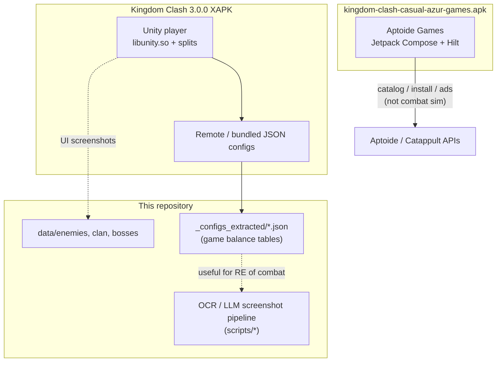
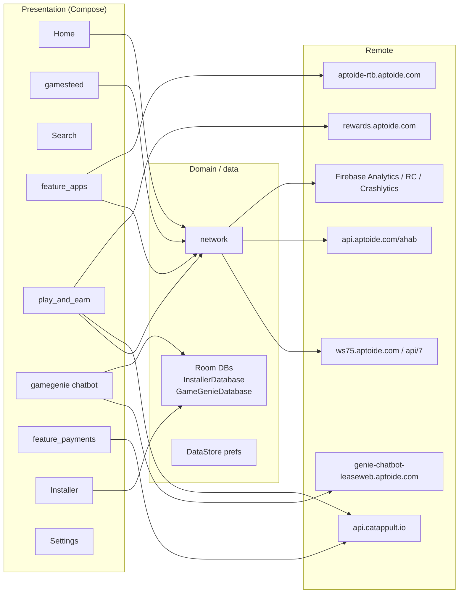
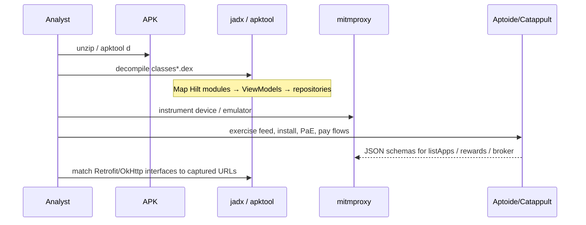
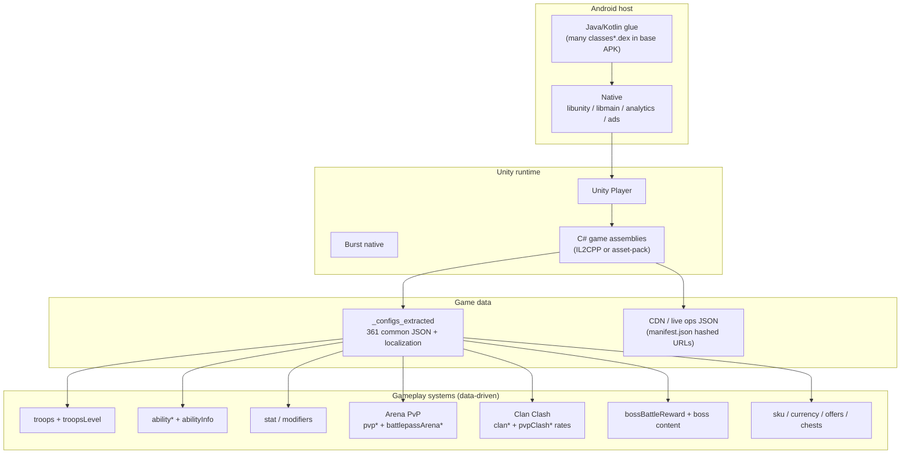
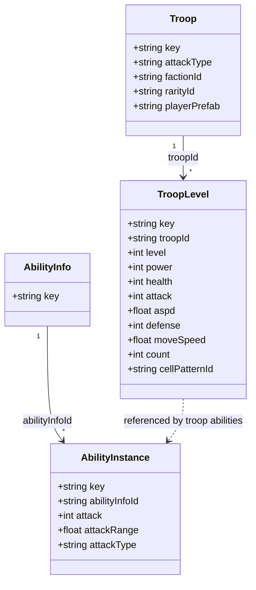
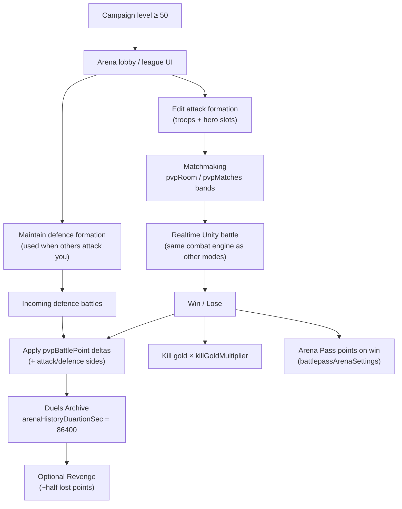
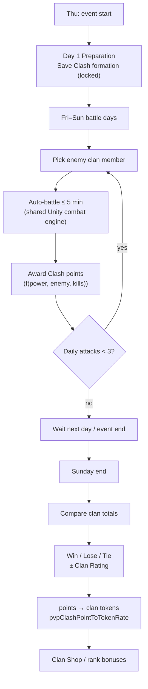
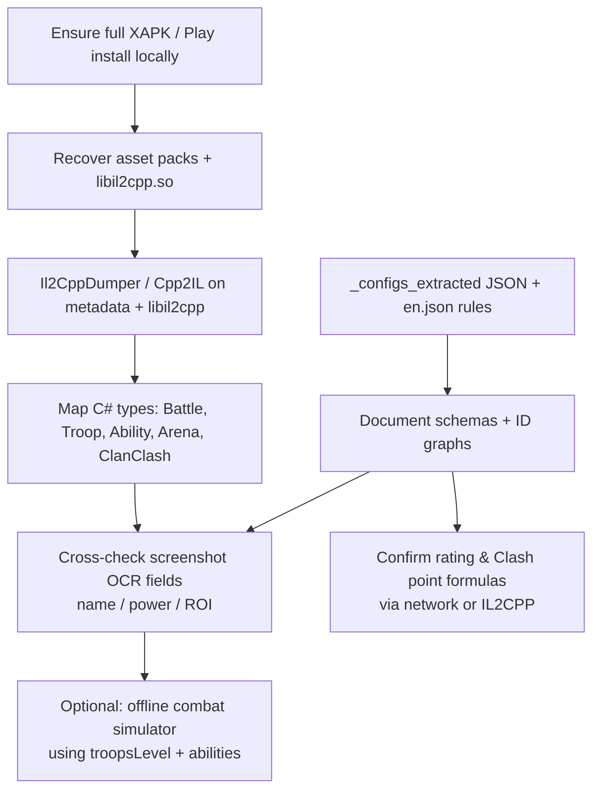

# Architecture: APK reverse engineering

**Audience:** further reverse engineering of Android packages related to Kingdom Clash / Azur Games tooling in this repo.  
**Date:** 2026-08-14 (updated: Arena + Clan Clash battle rules from `_configs_extracted` + `localization/en.json`)  
**Primary artifact analyzed:** `data/kingdom-clash-casual-azur-games.apk` (~10.3 MB)  
**Battle rules source of truth:** Kingdom Clash Unity extract configs + EN localization (not the Aptoide APK)

---

## 0. Critical identification result

| Artifact | Declared / expected | Actual product |
|----------|---------------------|----------------|
| `data/kingdom-clash-casual-azur-games.apk` | Filename suggests Kingdom Clash (Azur Games) casual build | **Aptoide Games** store / PWA-style Android client (`com.aptoide.android.aptoidegames`) |
| `data/Kingdom Clash - War army games_3.0.0_APKPure/` | Kingdom Clash 3.0.0 XAPK extract | **Real Kingdom Clash** (`azurgames.idle.war`), Unity + remote config JSON |

**Do not treat the casual-named APK as the combat game.** It is a third-party Android game store (Aptoide Games) with Play-and-Earn, installer, payments, and catalog features. Game combat / troop / arena logic for this repository lives in the **Unity XAPK extract** and its `_configs_extracted` tree.

Working unpack of the casual APK (derived, local):

- `data/_apk_analysis_casual/` (zip extract of the `.apk`)
- `data/_apk_analysis_casual.zip` (copy used for Expand-Archive)

---

## 1. System context

---

## 2. Artifact A — Aptoide Games APK

### 2.1 Package facts

| Field | Value |
|-------|--------|
| File | `data/kingdom-clash-casual-azur-games.apk` |
| Size | ~10.32 MB |
| Application id (from DEX) | `com.aptoide.android.aptoidegames` |
| Entry types | `MainActivity`, `SupportActivity`, `UrlActivity` |
| Application class | `AptoideApplication` |
| UI stack | **Jetpack Compose** 1.9.x / Material 1.8.x |
| DI | **Hilt** (`*_HiltModules_*` generated classes) |
| Language | Kotlin 2.1.10, Gradle 8.14, JVM target 17 |
| DEX | `classes.dex` (~11.0 MB) + `classes2.dex` (~2.0 MB) |
| Native code | Minimal AndroidX only (`libandroidx.graphics.path.so`, `libdatastore_shared_counter.so`) — **not** a Unity/game engine binary |
| ABIs | `arm64-v8a`, `armeabi-v7a`, `x86`, `x86_64` |

### 2.2 High-level component architecture

### 2.3 Feature packages (DEX map)

Primary Java/Kotlin namespace: `com.aptoide.android.aptoidegames.*`

| Package / feature | Role (inferred) |
|-------------------|-----------------|
| `home` | Home / landing |
| `gamesfeed` | Games feed + visibility ViewModels |
| `categories` | Category browsing + analytics hooks |
| `feature_apps` | App bundles / catalog cards |
| `search` | Search |
| `installer` | APK install pipeline + Room `InstallerDatabase` |
| `apkfy` | APK-related presentation / analytics |
| `updates` | Update checks |
| `play_and_earn` | Rewards, wallet units, Google sign-in, level-up |
| `feature_payments` | Payments UI + analytics; Catappult / AppCoins / PayPal / Adyen |
| `promo_codes`, `promotions`, `feature_promotional` | Promos |
| `feature_rtb` | Real-time bidding / ads |
| `feature_editors_choice_recommendation` | Editorial recommendations |
| `feature_oos` | Out-of-stock / availability handling |
| `feature_companion_apps_notification` | Companion notifications |
| `gamegenie` | Chatbot (`GameGenieViewModel`, conversation history DB) |
| `notifications`, `permissions` | Push / notification permission VMs |
| `network` | Connectivity state |
| `analytics` | Cross-cutting analytics injection |
| `videos` | Video content |
| `settings`, `support`, `developer`, `launch` | Settings / support / launch |

Also present: `com.aptoide.apk.injector` / `extractor` (APK tooling).

### 2.4 Network / API surface (strings from DEX)

| Host / base | Likely use |
|-------------|------------|
| `https://ws75.aptoide.com/api/7.20240701/` | Core store API (listApps, curation cards, `store_name=aptoide-games`) |
| `https://ws75-cache.aptoide.com/api/7.20240701/` | Cached store API |
| `https://webservices.aptoide.com/api/7/` | Legacy / alternate webservice |
| `https://api.aptoide.com/ahab/8.20240801/` | Ahab API |
| `https://reactions.api.aptoide.com/echo/8.20181122/` | Reactions (matches bundled Lottie JSONs) |
| `https://api.catappult.io/broker|productv2/...` | Catappult billing / products |
| `https://apichain.catappult.io/` | Payment chain |
| `https://rewards.aptoide.com/` | Play-and-earn rewards |
| `https://aptoide-rtb.aptoide.com` | RTB ads |
| `https://aptoide-mmp.aptoide.com/api/v1/` | MMP / attribution |
| `https://genie-chatbot-leaseweb.aptoide.com/` | GameGenie chatbot |
| `https://api.indicative.com/service/...` | Product analytics |
| Firebase Installations / Remote Config / Measurement | Telemetry & remote flags |
| Adyen checkout + PayPal Magnes | Payment SDKs |

Bundled `assets/*.json` (`down`, `laugh`, `like`, `love`, `thug`) are **reaction animations** (Lottie-style), not game balance data.

### 2.5 Suggested RE workflow (Aptoide APK)

**Practical next steps**

1. Install [jadx](https://github.com/skylot/jadx) and decompile `classes.dex` + `classes2.dex`.
2. Decode binary `AndroidManifest.xml` with `apktool` / `aapt2` (not present on this machine at analysis time).
3. Start from `AptoideApplication` and `MainActivity`; follow Compose navigation graph.
4. Export Room schemas from `InstallerDatabase` / `GameGenieDatabase`.
5. Capture traffic to `ws75*.aptoide.com` and `api.catappult.io` for DTO documentation.
6. **Stop here for Kingdom Clash combat RE** — switch to Artifact B.

---

## 3. Artifact B — Kingdom Clash (Azur Games) Unity XAPK

### 3.1 Package facts (from APKPure `manifest.json`)

| Field | Value |
|-------|--------|
| Path | `data/Kingdom Clash - War army games_3.0.0_APKPure/` |
| Package | `azurgames.idle.war` |
| Display name | Kingdom Clash |
| Version | `3.0.0` (`version_code` 486) |
| Min / target SDK | 23 / 35 |
| Delivery | XAPK splits: base `azurgames.idle.war.apk`, `config.arm64_v8a.apk`, `main.apk` |
| Engine | **Unity** (`libunity.so` ~22 MB, `libmain.so` bootstrap, Burst `lib_burst_generated.so`) |
| Firebase project | `kingdom-clash---battle-sim` (`assets/google-services-desktop.json`) |
| Unity Services | Purchasing 4.13.0, Core 1.14.0, Analytics 6.0.3 (production) |
| Monetization / ads libs | AppLovin, Pangle/TikTok (`libtt_*`), Firebase Crashlytics, AppMetrica |

**Note:** Large install-time content under `main/assets/assetpack/main` and `libil2cpp.so` are gitignored / may be absent locally. Expect IL2CPP game logic + StreamingAssets in those packs when fully installed.

### 3.2 Runtime architecture (game)

### 3.3 Config-driven combat model (high value for this repo)

Extracted tables: `data/Kingdom Clash - War army games_3.0.0_APKPure/_configs_extracted/`

| Area | Files (examples) | Notes |
|------|------------------|-------|
| Troop identity | `troops.json` | ~51 troop keys; faction, attackType (`Melee`/`Range`), prefabs, rarity |
| Troop progression | `troopsLevel.json` | Per-level `power`, `health`, `attack`, ranges, `aspd`, `defense`, `moveSpeed`, `count`, formation `cellPatternId` |
| Squad placement | `troopsSquadCellPattern.json` | 12 cell patterns (`LineCenter`, `Cross`, `Full`, …) by unit count |
| Abilities | `ability*.json`, `abilityInfo.json`, `troopsAbility.json` | Links `troopLevelId` → special + default (melee/range) ability |
| Status flags | `stat.json` | `isBoss`, `isHero`, `fear`, `invulnerable`, `unTargetable`, … |
| Modifiers | `unitParameterModifier*.json`, `abilityAddUnitModifier*.json` | Buff/debuff plumbing |
| Arena / PvP | `pvpConstants`, `pvpLeague`, `pvpRoom`, `pvpMatches`, `pvpBattlePoint`, `pvpExtraBattles`, `battlepassArenaSettings` | Matchmaking rooms, rating deltas, seasons, Arena Pass |
| Clan / Clan Clash | `clanConstants`, `clanRank`, `clanLevel`, `clanRole`, `clanMemberLimit` | Clash schedule/rules mainly in localization; rates in `clanConstants` |
| Boss rewards | `bossBattleReward.json` | Boss mode economy |
| Live-ops index | `_configs_extracted/manifest.json` | Path + content hash query (`?v=<md5>`) for each JSON |

**Example relationship (troop → level → ability):**

### 3.4 Arena (PvP) — rules and workflow

Sources: `localization/en.json` keys **549–550** (canonical Arena Rules for this build), **1306**, **4**; configs `pvpConstants.json`, `pvpLeague.json`, `pvpRoom.json`, `pvpMatches.json`, `pvpBattlePoint.json`, `pvpExtraBattles.json`, `battlepassArenaSettings.json`.

#### 3.4.1 Player-facing rules (EN 550; aligned with configs)

| # | Rule | Config evidence |
|---|------|-----------------|
| 1 | Arena PvP vs other players for rating + awards | — |
| 2 | Attack others to earn rating points | `pvpBattlePoint.json` attack win/lose |
| 3 | Gold for killed units is **tripled** in Arena | `pvpConstants.killGoldMultiplier = 3` (EN **1816** still says “doubles” — stale string) |
| 4 | **20 attacks per day** | Soft limit in client/server; extras via gems |
| 5 | Win → rating up; lose → rating down | `pvpBattlePoint` attack/defence win & lose bases |
| 6 | Others can attack you; **Revenge** from Duels Archive | `requestArenaDefenceAtPeriodInSec = 60` |
| 7 | Revenge returns **half** of lost points | Client/server formula (not fully in JSON) |
| 8 | Season rewards: max league + rating **above 4000** | EN 407 / 574; `pvpBattlePoint` has `range4000` / `range10000` tiers |
| 9 | Season length **2 weeks** | Arena Pass seasons in `battlepassArenaSettings` |
| 10 | Cheats prohibited | — |

Unlock: Arena available from **campaign level 50** (EN **4**). During season rollup, Arena is unavailable (EN **5**).

Extra attacks: `pvpExtraBattles.json` — 5 gem purchases (`150 → 250 → 450 → 600 → 750` gems).

#### 3.4.2 Arena workflow

#### 3.4.3 Matchmaking & leagues (data)

**Leagues** (`pvpLeague.json`): Bronze I–III, Silver I–III, Gold I–III, Platinum I–III, Diamond I–III, Master I (`bronze01` … `master01`).

**Rooms** (`pvpRoom.json`) — bot/fill generation bands for lobby populations:

| Room | Rating band | Population cap | Enemy power span (gen rules) | `powerDivider` |
|------|-------------|----------------|------------------------------|----------------|
| `bronzeRoom` | 900–1649 | 250 | ~3k–54k | 60 |
| `silverRoom` | 1650–1999 | 250 | ~54k–120k | 60 |

Each `generationRules[]` entry: `weight`, `min/maxPoints`, `min/maxPower`, `powerDivider`, `avatarSetId`.

**Progression brackets** (`pvpMatches.json`): 7 tiers keyed by cumulative `matchNumber` (1, 3, 7, 15, 25, 50, 100) with rising `min/maxPower`, `min/maxPoints`, `min/maxHeroLevel`, shared `formationSetId: pvpFormationSet_1`.

**Rating delta table** (`pvpBattlePoint.json`) — tiers by `maxPoints` (1500 / 1850 / 2250 / 4000 / 10000). All tiers share the same base constants in this extract:

| Side | Win base | Lose base | Factor |
|------|----------|-----------|--------|
| Attack | 25 | 15 | 400 |
| Defence | 25 | 10 | 400 |

Exact combination with rating difference is **server/IL2CPP** (factor suggests a scaled diff term). Document fields; confirm formula in binary/network next.

**Constants** (`pvpConstants.json`):

| Key | Value | Meaning |
|-----|-------|---------|
| `killGoldMultiplier` | 3 | Arena kill gold ×3 |
| `arenaHistoryDuartionSec` | 86400 | Duels archive retention (1 day) |
| `requestArenaDefenceAtPeriodInSec` | 60 | Defence request cadence |
| `winBattlePassPoints` | 0 | Placeholder / overridden live |
| `missingHeroId` / `missingTroopId` | `dragonRider` / `paladin` | Fallbacks |

**Arena Pass** (`battlepassArenaSettings.json`): seasonal featured units (Stone Golem, Mountains Champion, Vulkan Golem, Nighthunter/`flyingMonster`, Necromancer, Alchemist) linked via `battlepassLinkId` → `ArenaSeason_*`.

#### 3.4.4 Shared combat layer (used by Arena fights)

Arena does **not** define separate hit formulas in JSON; fights reuse the troop/ability stack:

1. Deploy formation → units spawn from `troopsLevel` (`count`, `cellPatternId` → `troopsSquadCellPattern`).
2. Each unit has default + special ability via `troopsAbility` (`defaultAbilityId`, `abilityId`).
3. Tick combat uses ability params (`attack`, `attackRange`, `aspd`, …) and `stat` flags / modifiers.
4. End state feeds rating / gold / pass — not a separate “arena physics” table.

Roles for UI/meta: `troopsRole.json` → `tank_Role`, `ranger_Role`, `support_Role`, `trickster_Role`.

---

### 3.5 Clan Clash — rules and workflow

Sources: EN **2240** (rules), **1913–1914**, **1962**, **2234**; configs `clanConstants.json`, `clanRank.json`, `clanLevel.json`, `clanRole.json`, `clanMemberLimit.json`.

#### 3.5.1 Player-facing Clan Clash rules (EN 2240)

1. Runs **weekly Thursday → Sunday**.
2. **Day 1 – Preparation:** set & save formation (**locked** for the event). Formation changes here do **not** affect other modes (EN **2234**).
3. **Days 2–4 – Battles:** fight enemy clan players up to **3 times/day**.
4. Battles are **auto-fought**, hard cap **5 minutes**.
5. Points scale with **your army power**, **enemy strength**, and **units defeated** (exact weights not in JSON → server/IL2CPP).
6. Clan with the **most points** wins.
7. Members who **joined mid-event** cannot fight.
8. After the event, points convert to **clan currency**.
9. Temporary currency boost note (live-ops copy).

#### 3.5.2 Clan Clash workflow

#### 3.5.3 Economy & rank (data)

**Conversion** (`clanConstants.json`):

| Key | Value | Interpretation |
|-----|-------|----------------|
| `pvpClashPointToTokenRate` | `0.00037` | `tokens ≈ clashPoints × 0.00037` |
| `pvpClashTokenBattleLimit` | `2000` | Cap related to token grant per battle / day (confirm in binary) |
| `maxMembersCount` | 50 | Matches `clanMemberLimit` (all ranks `limit: 50` in this extract) |
| Create / edit clan | 2500 / 1500 gems | — |

**Clan rating ranks** (`clanRank.json`): ranks 1–15 with `requiredRating` 1000 → 16000. After rank 15, rank can grow but **no new bonuses** (EN **1914**). Bonuses include: +5% clan coins per rank from Clashes, end-of-clash bonus coins by rank, Clan Shop unlocks.

**Coin tiers for shop** (EN **1962**): ranks 1–4 → tier 1; 5–8 → tier 2; ≥9 → tier 3. Higher-tier coins buy lower-tier items 1:1. Shop refreshes daily.

**Roles** (`clanRole.json`): `recruit` (100), `officer`/`advisor` (500), `owner`/`leader` (1000).

#### 3.5.4 Arena vs Clan Clash vs Tournament (related PvP)

| Mode | Schedule | Formation | Fight style | Score | Notes |
|------|----------|-----------|-------------|-------|-------|
| **Arena** | Continuous; **2-week** seasons | Attack + defence decks | Player-driven battles | League rating (`pvpBattlePoint`) | 20 attacks/day; revenge; ×3 kill gold |
| **Clan Clash** | Thu–Sun weekly | Locked Clash-only formation | **Auto**, ≤5 min | Clan points → coins | 3 attacks/day; mid-join blocked |
| **Faction Tournament** | Every **2 weeks**, 4 days | Defence formation; faction-locked; **25** troops / **5** heroes | Attack + defence pair | Day ladder points | Unlock campaign **Lv 500**; win if more living units after 2 battles or win both (EN **1668**) |

Tournament victory rule (useful as a hint for “living units” combat end conditions shared with other modes):

- **Victory:** more living units after 2 battles **or** win both → **+3** points  
- **Draw:** equal living units → **+1**  
- **Defeat / DQ:** 0 points (no loss of points)

---

### 3.6 Suggested RE workflow (Kingdom Clash)

**Priority order for this repository**

1. **Data RE first** — schema catalog of `_configs_extracted/common/*.json` (already present, no IL2CPP required).
2. **Mode rules** — Arena / Clan Clash / Tournament from localization + `pvp*` / `clan*` (this section).
3. **UI RE** — align OCR ROIs (`scripts/ocr`, `scripts/extract_image.mjs`) with arena/clan HUD screenshots under `data/enemies`, `data/clan`.
4. **Formula RE** — `pvpBattlePoint` factor math; Clan Clash point weights; token conversion edge cases.
5. **Binary RE** — after restoring IL2CPP + `global-metadata.dat`.
6. **Network RE** — live config CDN + matchmaking/result payloads.

**Open questions (need IL2CPP / traffic)**

- Exact `attackWinPoints` + `attackWinFactor` composition vs opponent rating.
- Clan Clash point function of power / enemy / kills.
- Whether `pvpClashTokenBattleLimit` is per battle, per day, or soft cap.
- Default arena slot counts (troops vs heroes) outside tournament’s 25/5.

---

## 4. Comparison matrix

| Dimension | Casual-named APK | Kingdom Clash XAPK |
|-----------|------------------|--------------------|
| Real product | Aptoide Games store | Azur Games Kingdom Clash |
| Engine | Compose / Kotlin | Unity |
| Size | ~10 MB | ~1.3 GB total (splits) |
| Combat logic | None | Config + Unity code |
| Arena / Clan Clash | N/A | Yes (`pvp*`, `clan*`, EN rules) |
| Useful to OCR/wiki scripts | No | Yes (`troops*`, abilities, localization, arena HUDs) |
| RE difficulty (logic) | Medium (Java/Kotlin) | High (IL2CPP) + Medium (JSON) |

---

## 5. Recommended document set (follow-ups)

| Doc | Purpose |
|-----|---------|
| `doc/architecture/apk-reverse-engineering.MD` | This overview + Arena/Clan Clash workflows |
| `doc/architecture/clan_clash-battle.md` | Clan Clash headless battle simulator: rules, I/O schemas, combat/report workflow |
| `doc/architecture/kc-config-schema.MD` | Field-level schemas for `troops`, `troopsLevel`, ability families, `stat`, `pvp*` |
| `doc/architecture/kc-battle-formulas.MD` | Confirmed rating / Clash point / damage formulas (after binary or packet capture) |
| `doc/architecture/kc-il2cpp-map.MD` | After dumping: C# type → config key map |
| `doc/architecture/aptoide-games-api.MD` | Only if store/PaE traffic RE is in scope |

---

## 6. Tooling checklist

| Tool | Use |
|------|-----|
| `jadx` | Decompile Aptoide DEX |
| `apktool` / `aapt2` | Decode manifests & resources |
| `Il2CppDumper` / `Cpp2IL` | Kingdom Clash native game code (when packs present) |
| `AssetStudio` / UABE | Unity assets from recovered packs |
| `mitmproxy` / HTTP Toolkit | Capture Aptoide + KC live-ops HTTPS + match results |
| Existing repo scripts | OCR / LLM extract / wiki tables for HUD-facing RE |

---

## 7. Immediate actions for this workspace

1. **Rename or annotate** `kingdom-clash-casual-azur-games.apk` so it is not mistaken for Azur Games KC (e.g. note “Aptoide Games mislabeled”).
2. Prefer **`_configs_extracted` + `localization/en.json`** as the source of truth for Arena/Clan Clash rules and combat tables.
3. Use `data/enemies` / `data/clan` screenshots to validate HUD fields against Arena / Clan Clash flows in §3.4–3.5.
4. If binary RE of KC is required, restore ignored asset pack + `libil2cpp.so` from a full install before dumping.
5. Keep analysis extracts (`data/_apk_analysis_casual*`) local/untracked (gitignored).
