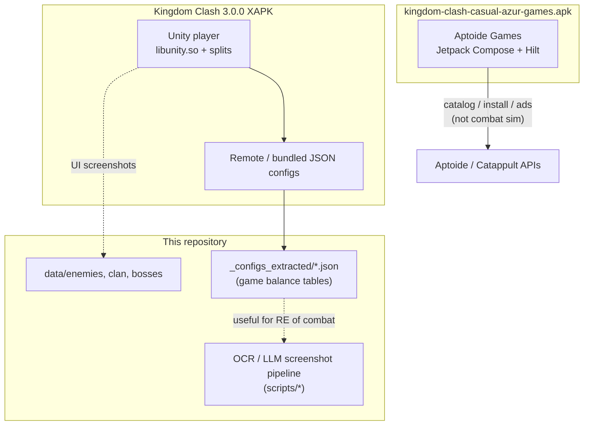
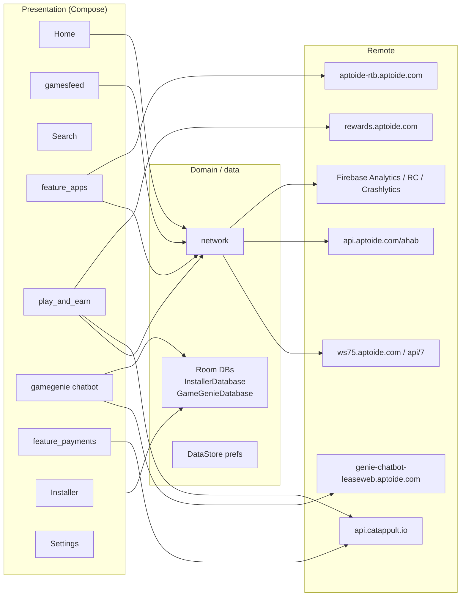
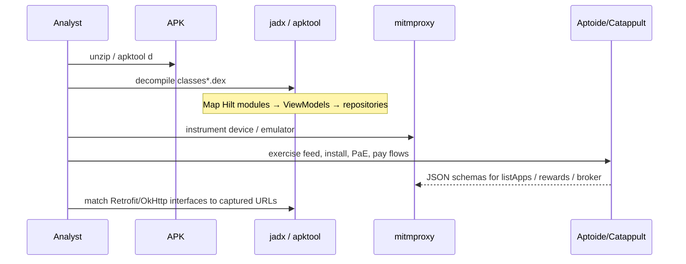
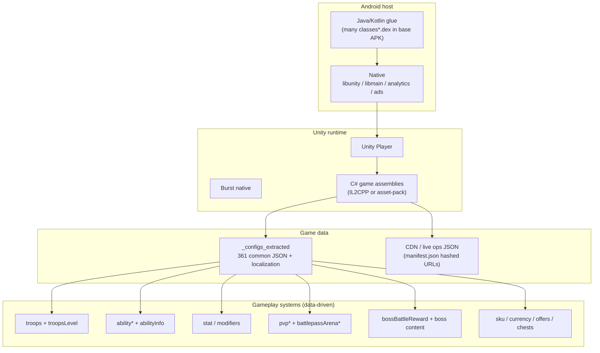
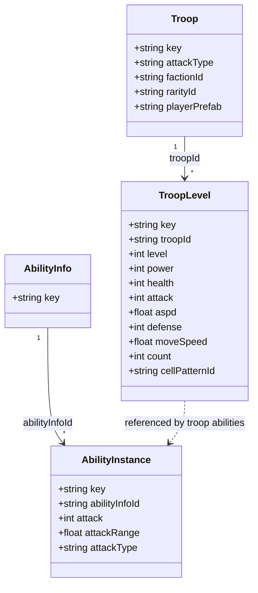
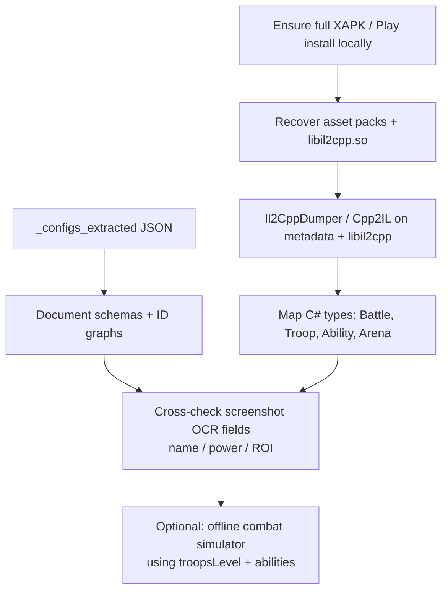

# Architecture: APK reverse engineering

**Audience:** further reverse engineering of Android packages related to Kingdom Clash / Azur Games tooling in this repo.  
**Date:** 2026-08-14  
**Primary artifact analyzed:** `data/kingdom-clash-casual-azur-games.apk` (~10.3 MB)

---

## 0. Critical identification result

| Artifact | Declared / expected | Actual product |
|----------|---------------------|----------------|
| `data/kingdom-clash-casual-azur-games.apk` | Filename suggests Kingdom Clash (Azur Games) casual build | **Aptoide Games** store / PWA-style Android client (`com.aptoide.android.aptoidegames`) |
| `data/Kingdom Clash - War army games_3.0.0_APKPure/` | Kingdom Clash 3.0.0 XAPK extract | **Real Kingdom Clash** (`azurgames.idle.war`), Unity + remote config JSON |

**Do not treat the casual-named APK as the combat game.** It is a third-party Android game store (Aptoide Games) with Play-and-Earn, installer, payments, and catalog features. Game combat / troop / arena logic for this repository lives in the **Unity XAPK extract** and its `_configs_extracted` tree.

Working unpack of the casual APK (derived, local):

- `data/_apk_analysis_casual/` (zip extract of the `.apk`)
- `data/_apk_analysis_casual.zip` (copy used for Expand-Archive)

---

## 1. System context

---

## 2. Artifact A — Aptoide Games APK

### 2.1 Package facts

| Field | Value |
|-------|--------|
| File | `data/kingdom-clash-casual-azur-games.apk` |
| Size | ~10.32 MB |
| Application id (from DEX) | `com.aptoide.android.aptoidegames` |
| Entry types | `MainActivity`, `SupportActivity`, `UrlActivity` |
| Application class | `AptoideApplication` |
| UI stack | **Jetpack Compose** 1.9.x / Material 1.8.x |
| DI | **Hilt** (`*_HiltModules_*` generated classes) |
| Language | Kotlin 2.1.10, Gradle 8.14, JVM target 17 |
| DEX | `classes.dex` (~11.0 MB) + `classes2.dex` (~2.0 MB) |
| Native code | Minimal AndroidX only (`libandroidx.graphics.path.so`, `libdatastore_shared_counter.so`) — **not** a Unity/game engine binary |
| ABIs | `arm64-v8a`, `armeabi-v7a`, `x86`, `x86_64` |

### 2.2 High-level component architecture

### 2.3 Feature packages (DEX map)

Primary Java/Kotlin namespace: `com.aptoide.android.aptoidegames.*`

| Package / feature | Role (inferred) |
|-------------------|-----------------|
| `home` | Home / landing |
| `gamesfeed` | Games feed + visibility ViewModels |
| `categories` | Category browsing + analytics hooks |
| `feature_apps` | App bundles / catalog cards |
| `search` | Search |
| `installer` | APK install pipeline + Room `InstallerDatabase` |
| `apkfy` | APK-related presentation / analytics |
| `updates` | Update checks |
| `play_and_earn` | Rewards, wallet units, Google sign-in, level-up |
| `feature_payments` | Payments UI + analytics; Catappult / AppCoins / PayPal / Adyen |
| `promo_codes`, `promotions`, `feature_promotional` | Promos |
| `feature_rtb` | Real-time bidding / ads |
| `feature_editors_choice_recommendation` | Editorial recommendations |
| `feature_oos` | Out-of-stock / availability handling |
| `feature_companion_apps_notification` | Companion notifications |
| `gamegenie` | Chatbot (`GameGenieViewModel`, conversation history DB) |
| `notifications`, `permissions` | Push / notification permission VMs |
| `network` | Connectivity state |
| `analytics` | Cross-cutting analytics injection |
| `videos` | Video content |
| `settings`, `support`, `developer`, `launch` | Settings / support / launch |

Also present: `com.aptoide.apk.injector` / `extractor` (APK tooling).

### 2.4 Network / API surface (strings from DEX)

| Host / base | Likely use |
|-------------|------------|
| `https://ws75.aptoide.com/api/7.20240701/` | Core store API (listApps, curation cards, `store_name=aptoide-games`) |
| `https://ws75-cache.aptoide.com/api/7.20240701/` | Cached store API |
| `https://webservices.aptoide.com/api/7/` | Legacy / alternate webservice |
| `https://api.aptoide.com/ahab/8.20240801/` | Ahab API |
| `https://reactions.api.aptoide.com/echo/8.20181122/` | Reactions (matches bundled Lottie JSONs) |
| `https://api.catappult.io/broker|productv2/...` | Catappult billing / products |
| `https://apichain.catappult.io/` | Payment chain |
| `https://rewards.aptoide.com/` | Play-and-earn rewards |
| `https://aptoide-rtb.aptoide.com` | RTB ads |
| `https://aptoide-mmp.aptoide.com/api/v1/` | MMP / attribution |
| `https://genie-chatbot-leaseweb.aptoide.com/` | GameGenie chatbot |
| `https://api.indicative.com/service/...` | Product analytics |
| Firebase Installations / Remote Config / Measurement | Telemetry & remote flags |
| Adyen checkout + PayPal Magnes | Payment SDKs |

Bundled `assets/*.json` (`down`, `laugh`, `like`, `love`, `thug`) are **reaction animations** (Lottie-style), not game balance data.

### 2.5 Suggested RE workflow (Aptoide APK)

**Practical next steps**

1. Install [jadx](https://github.com/skylot/jadx) and decompile `classes.dex` + `classes2.dex`.
2. Decode binary `AndroidManifest.xml` with `apktool` / `aapt2` (not present on this machine at analysis time).
3. Start from `AptoideApplication` and `MainActivity`; follow Compose navigation graph.
4. Export Room schemas from `InstallerDatabase` / `GameGenieDatabase`.
5. Capture traffic to `ws75*.aptoide.com` and `api.catappult.io` for DTO documentation.
6. **Stop here for Kingdom Clash combat RE** — switch to Artifact B.

---

## 3. Artifact B — Kingdom Clash (Azur Games) Unity XAPK

### 3.1 Package facts (from APKPure `manifest.json`)

| Field | Value |
|-------|--------|
| Path | `data/Kingdom Clash - War army games_3.0.0_APKPure/` |
| Package | `azurgames.idle.war` |
| Display name | Kingdom Clash |
| Version | `3.0.0` (`version_code` 486) |
| Min / target SDK | 23 / 35 |
| Delivery | XAPK splits: base `azurgames.idle.war.apk`, `config.arm64_v8a.apk`, `main.apk` |
| Engine | **Unity** (`libunity.so` ~22 MB, `libmain.so` bootstrap, Burst `lib_burst_generated.so`) |
| Firebase project | `kingdom-clash---battle-sim` (`assets/google-services-desktop.json`) |
| Unity Services | Purchasing 4.13.0, Core 1.14.0, Analytics 6.0.3 (production) |
| Monetization / ads libs | AppLovin, Pangle/TikTok (`libtt_*`), Firebase Crashlytics, AppMetrica |

**Note:** Large install-time content under `main/assets/assetpack/main` and `libil2cpp.so` are gitignored / may be absent locally. Expect IL2CPP game logic + StreamingAssets in those packs when fully installed.

### 3.2 Runtime architecture (game)

### 3.3 Config-driven combat model (high value for this repo)

Extracted tables: `data/Kingdom Clash - War army games_3.0.0_APKPure/_configs_extracted/`

| Area | Files (examples) | Notes |
|------|------------------|-------|
| Troop identity | `troops.json` | ~51 troop keys; faction, attackType (`Melee`/`Range`), prefabs, rarity |
| Troop progression | `troopsLevel.json` | Per-level `power`, `health`, `attack`, ranges, `aspd`, `defense`, `moveSpeed`, `count`, formation `cellPatternId` |
| Abilities | `ability*.json`, `abilityInfo.json` | Large family: melee/range/AoE/summon/boss (e.g. `abilityKrakenCannon`) |
| Ability leveling | `abilityMelee.json`, … | Links `abilityInfoId` + numeric combat params |
| Status flags | `stat.json` | `isBoss`, `isHero`, `fear`, `invulnerable`, `unTargetable`, … |
| Modifiers | `unitParameterModifier*.json`, `abilityAddUnitModifier*.json` | Buff/debuff plumbing |
| Arena / PvP meta | `battlepassArenaSettings.json`, `pvpBattlePoint.json`, `pvpExtraBattles.json` | Meta progression around arena |
| Boss rewards | `bossBattleReward.json` | Boss mode economy |
| Live-ops index | `_configs_extracted/manifest.json` | Path + content hash query (`?v=<md5>`) for each JSON |

**Example relationship (troop → level → ability):**

### 3.4 Suggested RE workflow (Kingdom Clash)

**Priority order for this repository**

1. **Data RE first** — schema catalog of `_configs_extracted/common/*.json` (already present, no IL2CPP required).
2. **UI RE** — align OCR ROIs (`scripts/ocr`, `scripts/extract_image.mjs`) with in-game HUD layouts from screenshots under `data/enemies`, `data/boss_*`.
3. **Binary RE** — only after restoring IL2CPP + `global-metadata.dat` from a complete device install / full XAPK.
4. **Network RE** — capture live config CDN URLs matching `manifest.json` hash pattern; compare with local extracts for drift.

---

## 4. Comparison matrix

| Dimension | Casual-named APK | Kingdom Clash XAPK |
|-----------|------------------|--------------------|
| Real product | Aptoide Games store | Azur Games Kingdom Clash |
| Engine | Compose / Kotlin | Unity |
| Size | ~10 MB | ~1.3 GB total (splits) |
| Combat logic | None | Config + Unity code |
| Useful to OCR/wiki scripts | No | Yes (`troops*`, abilities, localization) |
| RE difficulty (logic) | Medium (Java/Kotlin) | High (IL2CPP) + Medium (JSON) |

---

## 5. Recommended document set (follow-ups)

| Doc | Purpose |
|-----|---------|
| `doc/architecture/apk-reverse-engineering.MD` | This overview |
| `doc/architecture/kc-config-schema.MD` | Field-level schemas for `troops`, `troopsLevel`, ability families, `stat` |
| `doc/architecture/kc-il2cpp-map.MD` | After dumping: C# type → config key map |
| `doc/architecture/aptoide-games-api.MD` | Only if store/Pae traffic RE is in scope |

---

## 6. Tooling checklist

| Tool | Use |
|------|-----|
| `jadx` | Decompile Aptoide DEX |
| `apktool` / `aapt2` | Decode manifests & resources |
| `Il2CppDumper` / `Cpp2IL` | Kingdom Clash native game code (when packs present) |
| `AssetStudio` / UABE | Unity assets from recovered packs |
| `mitmproxy` / HTTP Toolkit | Capture Aptoide + KC live-ops HTTPS |
| Existing repo scripts | OCR / LLM extract / wiki tables for HUD-facing RE |

---

## 7. Immediate actions for this workspace

1. **Rename or annotate** `kingdom-clash-casual-azur-games.apk` so it is not mistaken for Azur Games KC (e.g. note “Aptoide Games mislabeled”).
2. Prefer **`_configs_extracted`** as the source of truth for combat architecture docs and any offline simulator.
3. If binary RE of KC is required, restore ignored asset pack + `libil2cpp.so` from a full install before dumping.
4. Keep analysis extracts (`data/_apk_analysis_casual*`) local/untracked or add to `.gitignore` (derived from APK).
