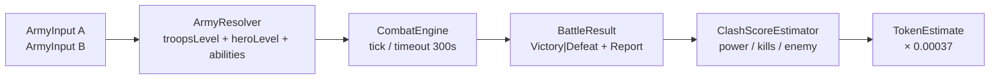
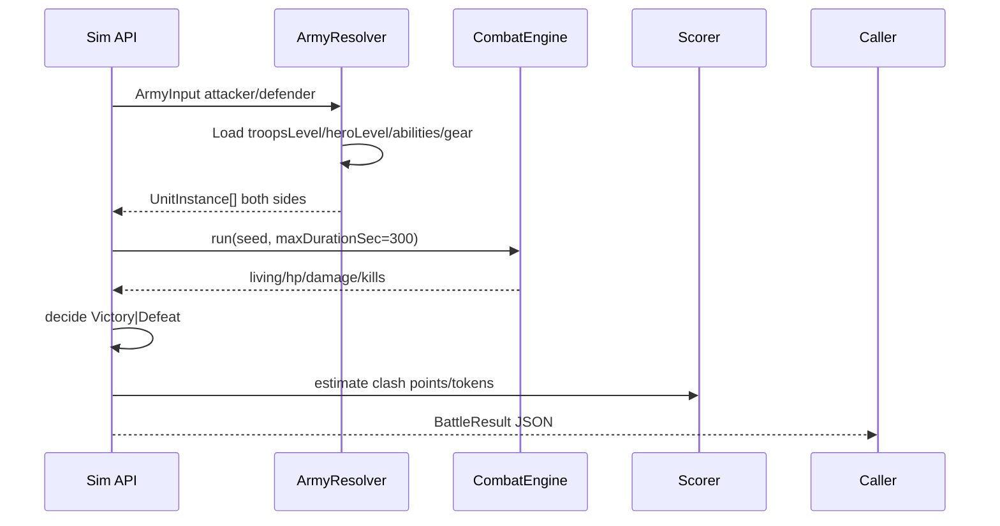
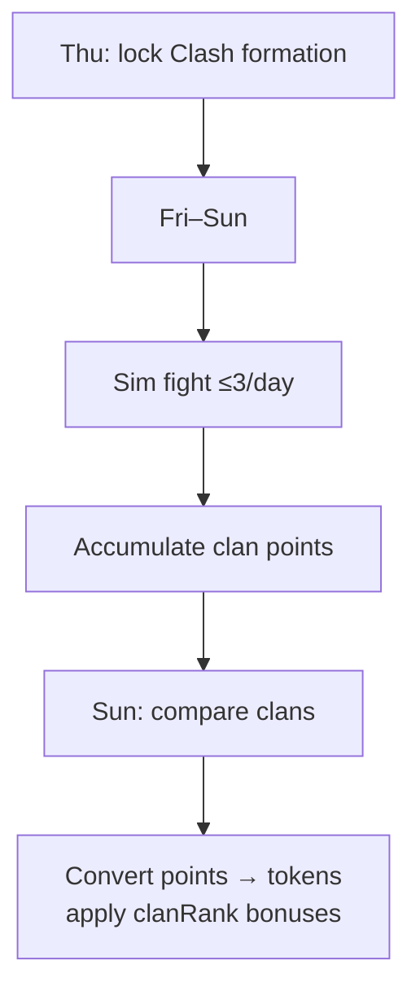

# Clan Clash battle — simulator specification

**Goal:** Collect rules, data structures, and workflows needed to build a **headless Clan Clash battle simulator** (no animation): input two armies → emit Victory/Defeat + battle report metrics (damage dealt, units lost, clash points estimate, etc.).

**Sources (Kingdom Clash 3.0.0 extract):**

- `_configs_extracted/common/{troops,troopsLevel,troopsAbility,troopsSquadCellPattern,ability*,abilityInfo,hero,heroLevel,heroAbility,gear,gearLevel,stat,clanConstants,clanRank}.json`
- `_configs_extracted/localization/en.json` (keys **2240**, **2234**, **2243–2244**, **814**, **85–86**, **723**, **2118**)
- Cross-ref: `doc/architecture/apk-reverse-engineering.MD` §3.5

**Out of scope for v1 sim:** Unity animation/VFX, navigation meshes, projectile visuals, network matchmaking UI.

---

## 1. Mode rules (Clan Clash)

### 1.1 Event rules (EN 2240)

| # | Rule | Simulator impact |
|---|------|------------------|
| 1 | Weekly **Thu → Sun** | Calendar / schedule only (optional wrapper) |
| 2 | **Day 1 – Preparation:** save formation; **locked** for event | Input army is fixed; Clash formation ≠ Arena formation (EN **2234**) |
| 3 | **Days 2–4:** up to **3 attacks/day** vs enemy clan members | Attempt counter outside core fight engine |
| 4 | Battles **auto-fought**, max **5 minutes** | Hard timeout `T_max = 300s`; force resolve if unfinished |
| 5 | Points scale with **your power**, **enemy strength**, **units defeated** | Post-fight scoring (formula TBD — see §6) |
| 6 | Clan with most points wins the event | Aggregate layer, not single-fight |
| 7 | Mid-event joiners cannot fight | Eligibility gate |
| 8 | Points → clan currency after event | `tokens ≈ points × pvpClashPointToTokenRate` |
| 9 | Temporary currency boost (live-ops copy) | Config/live flag |

### 1.2 Economy constants (`clanConstants.json`)

| Key | Value | Use |
|-----|-------|-----|
| `pvpClashPointToTokenRate` | `0.00037` | `clanTokens = min(?, clashPoints * 0.00037)` |
| `pvpClashTokenBattleLimit` | `2000` | Likely per-battle or soft cap — **unconfirmed** |
| `maxMembersCount` | `50` | Clan roster |

### 1.3 Outcome labels (UI)

| Result | EN keys |
|--------|---------|
| Victory | **86** / **2243** |
| Defeat | **85** / **2244** |
| Battle Report | **814** |
| Army's Total Power | **723** |

### 1.4 Important exclusions

- Hero **collection power-ups** (EN **2118**): bonuses apply to **Arena and Boss only** — **not Clan Clash**. Do not apply `heroCollection` / ownership army-wide buffs in Clash sim unless proven otherwise.
- Per-hero **in-battle abilities** and gear abilities still apply if those units are in the Clash formation (same combat stack as other modes).

---

## 2. Simulator architecture (target)



**Phases**

1. **Resolve** config IDs → runtime unit instances (stats, counts, abilities).
2. **Simulate** combat until wipe / timeout / stalemate rule.
3. **Report** structured metrics for UI/tests.
4. **Score** Clan Clash points + optional token estimate.

---

## 3. Input structures

### 3.1 Army input (proposed JSON)

Formation is a list of **slots**. Each slot is either a **troop** or a **hero** (heroes are single units with `count: 1` in `heroLevel`).

```json
{
  "playerId": "attacker",
  "displayName": "PlayerA",
  "totalPowerHint": 2069919,
  "slots": [
    {
      "slotIndex": 0,
      "kind": "troop",
      "troopId": "archer",
      "level": 10
    },
    {
      "slotIndex": 1,
      "kind": "troop",
      "troopId": "infantry",
      "level": 9
    },
    {
      "slotIndex": 6,
      "kind": "hero",
      "heroId": "general",
      "level": 12,
      "gear": { "weapon": "aoeWeapon", "weaponLevel": 19, "armor": "aoeArmor", "armorLevel": 20 }
    }
  ]
}
```

Notes:

- `totalPowerHint` is optional; prefer computing Σ unit power from tables for fairness.
- Exact slot count / lane layout for Clan Clash is **not** fully confirmed in JSON (Arena UI often shows multi-column deploy; tournament uses 25 troops + 5 heroes). Treat slot list as ordered deploy positions; spatial layout can be approximated later.
- Gear keys in data: `aoeWeapon`, `aoeArmor`, `reflectWeapon`, `reflectArmor` (`gear.json` / `gearLevel.json`).

### 3.2 Battle request

```json
{
  "mode": "clan_clash",
  "seed": 42,
  "maxDurationSec": 300,
  "attacker": { "...ArmyInput..." },
  "defender": { "...ArmyInput..." }
}
```

- Clan Clash fights are **auto**; both armies are locked formations (attacker vs defender’s saved Clash deck).
- `seed` for deterministic RNG (crits/targeting variance once formulas known).

---

## 4. Data model (from configs)

### 4.1 Troop identity — `troops.json`

| Field | Example | Role |
|-------|---------|------|
| `key` | `archer` | Troop id |
| `attackType` | `Melee` \| `Range` | Basic combat style |
| `factionId` | `Human` \| `Undead` \| `Mage` | Faction filters / auras |
| `rarityId` | `common` / `rare` / … | Meta |
| `killReward` | `10` | Economy (Arena gold; Clash uses different scoring) |
| `сollisionRadius` | `0.5` | Physics (optional for abstract sim) |
| `stoppingDistance`, `navigationPriority` | … | Movement (optional v1) |

~**51** troop types in extract.

### 4.2 Troop level — `troopsLevel.json`

Key form: `{troopId}_{level}` e.g. `archer_1` … `archer_10`.

| Field | Meaning for sim |
|-------|-----------------|
| `power` | Contributes to army power & Clash scoring |
| `health` | HP pool **per spawned unit** (confirm vs squad) |
| `attack` | Base attack (also mirrored on default ability) |
| `defense` | Mitigation input (exact formula TBD) |
| `aspd`, `attackCooldown` | Attack timing |
| `attackRange`, `minAttackDistance` | Targeting range |
| `aoeRadius`, `aoeAngle` | AoE shape (`-1` = none) |
| `moveSpeed` | Movement |
| `count` | Number of unit instances spawned for this card |
| `cellPatternId` | → `troopsSquadCellPattern` placement pattern |

### 4.3 Squad cell patterns — `troopsSquadCellPattern.json`

| Pattern key | `count` | `patternId` |
|-------------|---------|-------------|
| `formation_single_center` | 1 | SingleCenter |
| `formation_single_down` | 1 | SingleDown |
| `formation_single_right` | 1 | SingleRight |
| `formation_double_separate_center` | 2 | DoubleSeparateCenter |
| `formation_double_separate_down` | 2 | DoubleSeparateDown |
| `formation_line_center` | 3 | LineCenter |
| `formation_line_down` | 3 | LineDown |
| `formation_arrow_down` | 3 | ArrowDown |
| `formation_blocks_separate_down` | 4 | BlocksSeparateDown |
| `formation_cross` | 5 | Cross |
| `formation_letter_big_h` | 7 | LetterH |
| `formation_full` | 9 | Full |

v1 abstract sim may ignore XY and only spawn `count` identical instances.

### 4.4 Troop abilities — `troopsAbility.json`

```text
troopLevelId → defaultAbilityId (basic attack)
             → abilityId (special; may be null)
```

Example: `archer_1` → `defaultAbilityId: archer_1_range`, `abilityId: null`.  
Example: `assasin_1` → special teleport + default melee.

Resolve numeric params from family tables: `abilityMelee.json`, `abilityRange.json`, `abilityAoeDamage.json`, …

### 4.5 Ability info — `abilityInfo.json`

Meta for specials: `isActive`, `sourceRestrictionId` / `targetRestrictionId` (ties to `stat.json` flags like `aiDisabled`, `unTargetable`), lobby icon flags.

### 4.6 Heroes — `hero.json` + `heroLevel.json` + `heroAbility.json`

- ~**37** heroes; flag `isAvailableForArena` (Clash availability not separately flagged — assume formation-legal heroes are usable).
- `heroLevel`: same combat fields as troops (`power`, `health`, `attack`, `defense`, `count: 1`, …) + `ownershipBonus` (collection — **skip in Clash** per EN 2118).
- `heroAbility`: `heroLevelId` → `abilityId` + `defaultAbilityId`.

### 4.7 Gear — `gear.json` + `gearLevel.json`

| Gear key | Slot |
|----------|------|
| `aoeWeapon` / `reflectWeapon` | Weapon |
| `aoeArmor` / `reflectArmor` | Armor |

`gearLevel` links `abilityId` (e.g. `aoeEvasion_1`) — apply as unit modifiers/abilities on the hero.

### 4.8 Status flags — `stat.json` (combat CC / immunities)

Examples: `canNotAttack`, `canNotMove`, `canNotSpecialAttack`, `invulnerable`, `unTargetable`, `fear`, `isHero`, `isBoss`, `isMindControlled`, `noDamage`, `oneShot`, …

Simulator should model at least: stun/fear → cannot act; invulnerable/untargetable → skip as target; isHero for report bucketing.

### 4.9 Roles — `troopsRole.json`

`tank_Role`, `ranger_Role`, `support_Role`, `trickster_Role` — optional report tags, not required for core fight.

---

## 5. Runtime unit instance (resolved)

```ts
type UnitInstance = {
  instanceId: string;
  side: "attacker" | "defender";
  kind: "troop" | "hero";
  templateId: string;       // troopId or heroId
  levelId: string;          // archer_10 / general_12
  name: string;
  factionId: string | null;
  isHero: boolean;
  power: number;
  hp: number;
  maxHp: number;
  attack: number;
  defense: number;
  aspd: number;
  attackCooldown: number;
  attackRange: number;
  minAttackDistance: number;
  moveSpeed: number;
  attackType: "Melee" | "Range";
  defaultAbilityId: string;
  specialAbilityId: string | null;
  flags: Set<string>;       // from stat.json keys
  damageDealt: number;      // accumulated for report
  damageTaken: number;
  kills: number;
};
```

Army power:

```text
armyPower = sum(unit.power for unit in spawnedInstances)
```

(Confirm whether `power` is per card or per instance — tables list power on the **card/level row** while `count` spawns many bodies; most idle tactics games treat card power as the squad’s contribution once. **Validate against in-game “Army's Total Power”.**)

---

## 6. Combat engine (v1 → v2)

### 6.1 Known hard constraints

| Constraint | Value | Source |
|------------|-------|--------|
| Max duration | **300 s** | EN 2240 |
| Resolution | Auto (no player input mid-fight) | EN 2240 |
| Engine | Same Unity combat as other modes | Architecture doc |

### 6.2 Victory / defeat (single Clash fight)

Official Clash copy does **not** spell the win condition. Closest documented PvP end-condition (faction tournament EN **1668**) uses **living units** after battles.

**Proposed Clash single-fight rules (implement + validate):**

1. If one side has **0 living units** → other side **Victory**.
2. Else at `t = 300s`:
   - More living units → Victory  
   - Equal living units → compare **remaining HP sum**, then **damage dealt**; if still tied → **Draw** (rare; map to Defeat for attacker in attack-oriented UX or explicit `Draw`)
3. Optional: wipe threshold when army power remaining &lt; ε.

Mark as **hypothesis** until confirmed via gameplay or IL2CPP.

### 6.3 Damage model (unknown — placeholder)

Exact `attack` vs `defense` formula is **not** in JSON. Suggested placeholder until dumped:

```text
raw = max(1, attack - k * defense)
damage = raw * abilityMult * (buffs)
```

Track `damageDealt` / `damageTaken` per unit for reports. Replace `k` when RE finds the real curve.

### 6.4 Targeting (placeholder)

- Prefer same-lane / nearest enemy in range (`attackRange` / `minAttackDistance`).
- Skip `unTargetable` / dead.
- Melee vs Range: respect range gates.

### 6.5 Tick loop (abstract)

```text
t = 0
while t < 300 and both sides have living units:
  for each living unit able to act:
    tick cooldowns / aspd
    if can attack: pick target, apply damage, update stats
    apply DoTs / auras / summons (v2+)
  t += dt
emit BattleResult
```

v1 may use large `dt` (e.g. 0.1–0.25s) without spatial movement (units always “in range” if range allows).

---

## 7. Output structures

### 7.1 `BattleResult`

```json
{
  "mode": "clan_clash",
  "outcome": "Victory",
  "outcomeReason": "enemy_wiped",
  "durationSec": 142.5,
  "timedOut": false,
  "attacker": {
    "playerId": "attacker",
    "displayName": "PlayerA",
    "armyPower": 2100000,
    "livingUnits": 12,
    "totalUnits": 40,
    "hpRemaining": 152000,
    "damageDealt": 980000,
    "damageTaken": 640000,
    "unitsKilled": 28,
    "unitsLost": 15
  },
  "defender": {
    "playerId": "defender",
    "displayName": "PlayerB",
    "armyPower": 1950000,
    "livingUnits": 0,
    "totalUnits": 38,
    "hpRemaining": 0,
    "damageDealt": 640000,
    "damageTaken": 980000,
    "unitsKilled": 15,
    "unitsLost": 38
  },
  "report": {
    "title": "Battle Report",
    "heroDamage": { "attacker": 120000, "defender": 90000 },
    "troopDamage": { "attacker": 860000, "defender": 550000 },
    "topDamageDealers": [
      { "side": "attacker", "templateId": "general", "name": "…", "damageDealt": 120000 }
    ],
    "unitSummaries": []
  },
  "clash": {
    "pointsEstimate": 0,
    "pointsFormula": "unconfirmed",
    "tokenEstimate": 0,
    "tokenRate": 0.00037,
    "tokenBattleLimit": 2000
  }
}
```

### 7.2 Report fields to mirror game UX

| Field | Notes |
|-------|-------|
| Victory / Defeat | EN 2243 / 2244 |
| Battle Report | EN 814 |
| Army's Total Power | EN 723 — show both sides |
| Damage dealt (total + per unit) | Primary sim metric |
| Units killed / lost | Feeds Clash scoring (“units defeated”) |
| Hero vs troop damage split | Useful parity with old practice UI |
| Duration / timeout flag | Clash 5‑minute cap |

### 7.3 Clash points estimate (placeholder)

EN: points scale with **your army power**, **enemy strength**, **units defeated**.

```text
# PLACEHOLDER — replace after RE
points ≈ w1 * attackerPower
       + w2 * f(enemyPower)
       + w3 * unitsDefeated
tokens ≈ min(tokenBattleLimit?, points * 0.00037)
```

Until weights are known, expose raw components in the report and set `pointsEstimate` only when a calibrated formula exists.

---

## 8. End-to-end workflows

### 8.1 Single fight (simulator core)



### 8.2 Event wrapper (optional)



Clan rank bonuses (EN **1914**): +5% clan coins per rank from Clashes; end bonus by rank; shop unlocks — apply in **reward** layer, not combat.

---

## 9. Config file checklist (load for sim)

| File | Required |
|------|----------|
| `troops.json` | yes |
| `troopsLevel.json` | yes |
| `troopsAbility.json` | yes |
| `troopsSquadCellPattern.json` | yes (spawn counts) |
| `abilityMelee.json` / `abilityRange.json` / other `ability*.json` | yes (as referenced) |
| `abilityInfo.json` | partial (restrictions) |
| `hero.json` / `heroLevel.json` / `heroAbility.json` | yes if heroes in formation |
| `gear.json` / `gearLevel.json` | yes if gear equipped |
| `stat.json` | yes (flag ids) |
| `clanConstants.json` | scoring/tokens |
| `localization/en.json` | labels only |

Path root:

`data/Kingdom Clash - War army games_3.0.0_APKPure/_configs_extracted/`

---

## 10. Implementation phases

| Phase | Deliverable |
|-------|-------------|
| **P0** | Types + resolver: ArmyInput → UnitInstance[] using config tables; compute army power |
| **P1** | Abstract combat: HP damage with placeholder formula; wipe/timeout; BattleResult JSON |
| **P2** | Basic abilities (melee/range only); hero/troop damage split in report |
| **P3** | Special abilities subset; status flags; gear abilities |
| **P4** | Calibrate damage + Clash points from captures / IL2CPP |
| **P5** | Event wrapper (3/day, token convert, rank bonuses) |

---

## 11. Open RE questions (block accurate parity)

1. Exact **damage** formula (`attack`, `defense`, buffs).
2. Whether `troopsLevel.health` / `power` are **per unit** or **per squad card**.
3. Official **Victory** rule for Clan Clash (wipe vs living-units vs HP).
4. Clash **points** weights for power / enemy / kills; interaction with `pvpClashTokenBattleLimit`.
5. Default **formation size** (slot count) for Clash vs Arena.
6. Which **hero collection** bonuses are truly disabled in Clash (EN 2118 vs live behavior).

---

## 12. Relation to this repo

| Asset | Use |
|-------|-----|
| `scripts/battle/run-battle.mjs` | **Headless Clan Clash sim CLI** (attacker.json, defender.json → battleResult.json) |
| `data/battle/examples/` | Sample armies + output |
| `data/clan/**` screenshots | Validate HUD power/name; compare report fields |
| `data/scenarios.json` | Early fixture style (slots + gear levels) — map names to real `troopId`/`heroId` |
| `doc/architecture/apk-reverse-engineering.MD` | Broader APK / Arena / Clash context |
| OCR / LLM pipelines | Not required for headless sim; useful for ingesting real enemy armies from screenshots later |

### CLI

```bash
node scripts/battle/run-battle.mjs <attacker.json> <defender.json> <battleResult.json> [--seed N]
# or
pnpm battle:clan-clash:example
```

---

## 13. Minimal acceptance tests

1. Two trivial armies (1 infantry L1 each) → deterministic wipe; report damage & living units.
2. Timeout path: unkillable stub units → `timedOut: true` at 300s; outcome by living/HP rule.
3. Army power equals sum of resolved card powers (document chosen interpretation).
4. Token estimate: `points * 0.00037` matches `clanConstants` when points mocked.
5. Snapshot BattleResult JSON schema stable for UI consumers.
